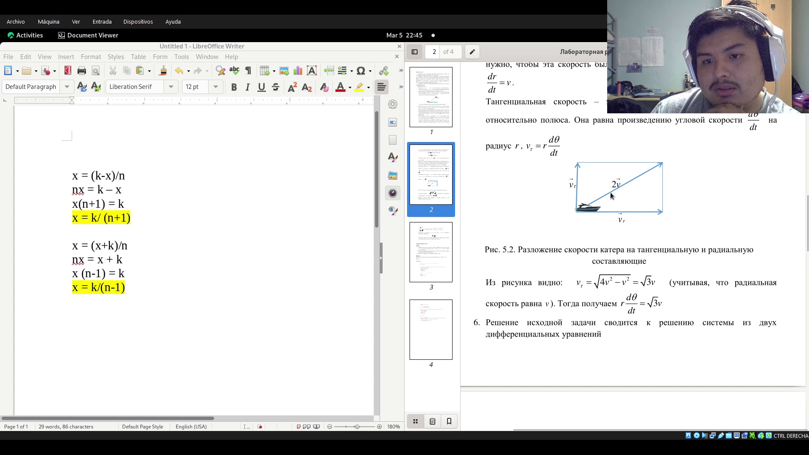
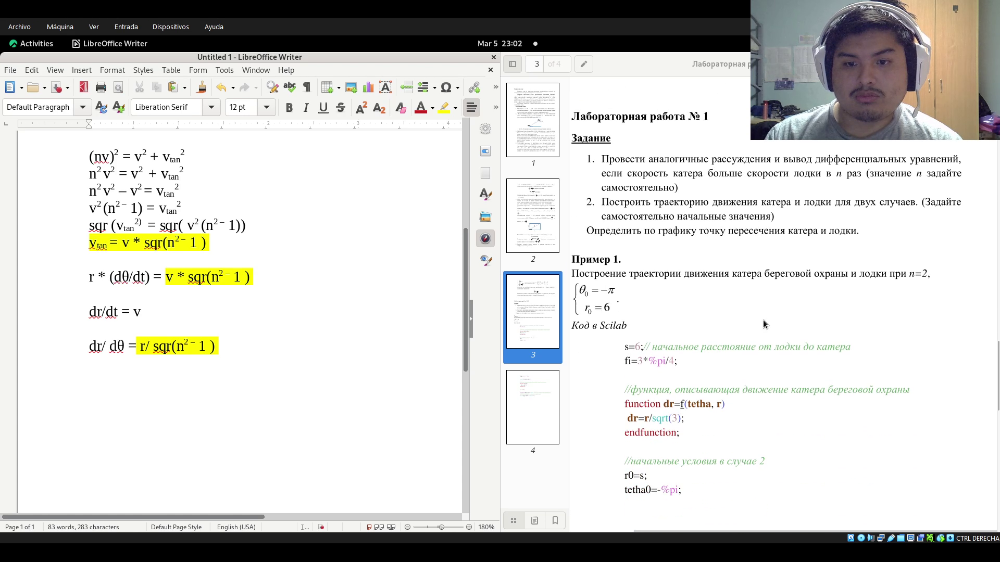
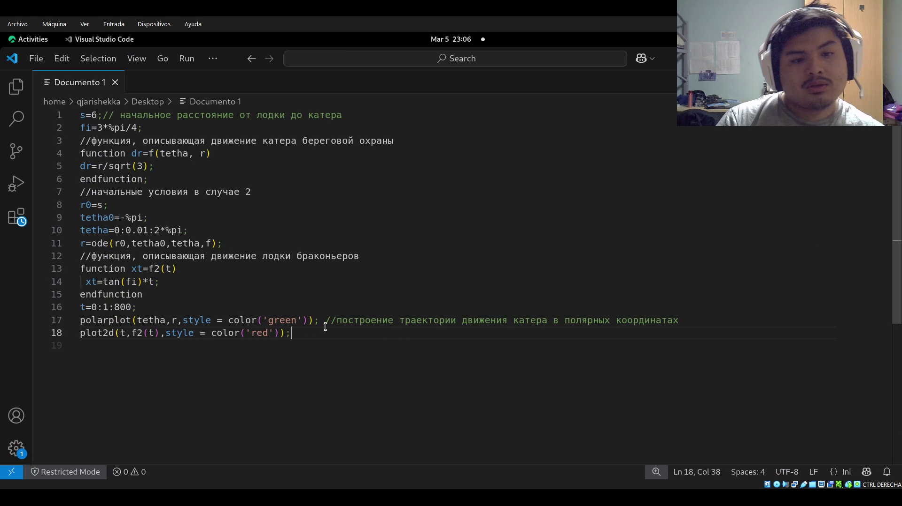
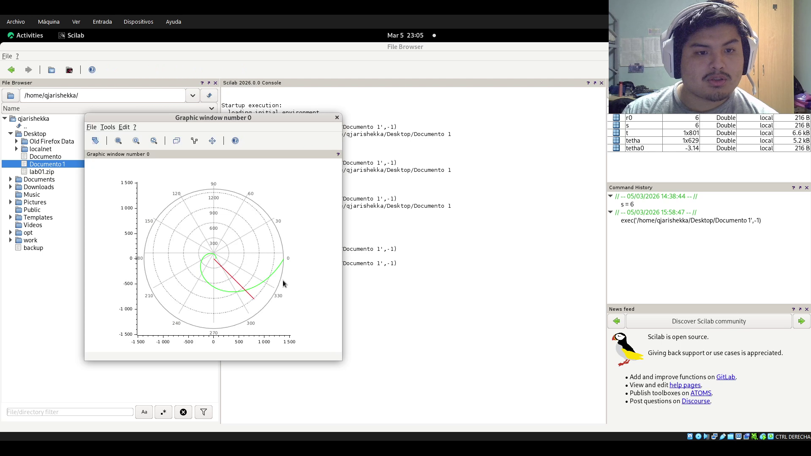
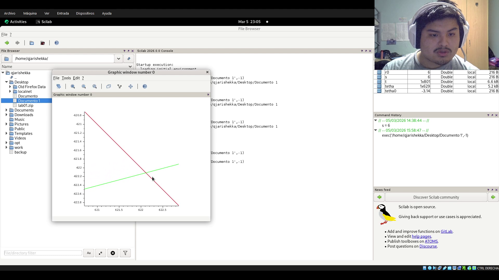
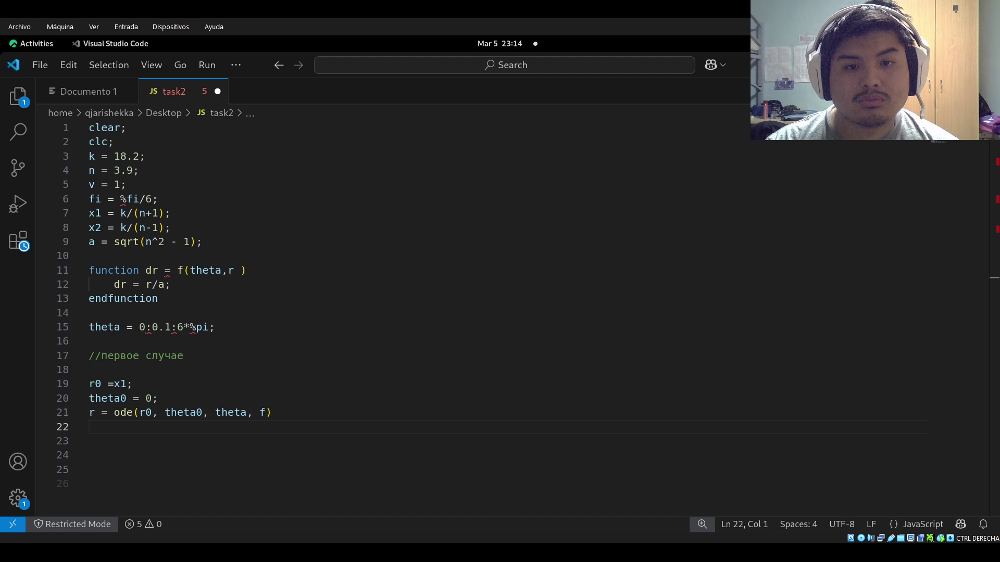
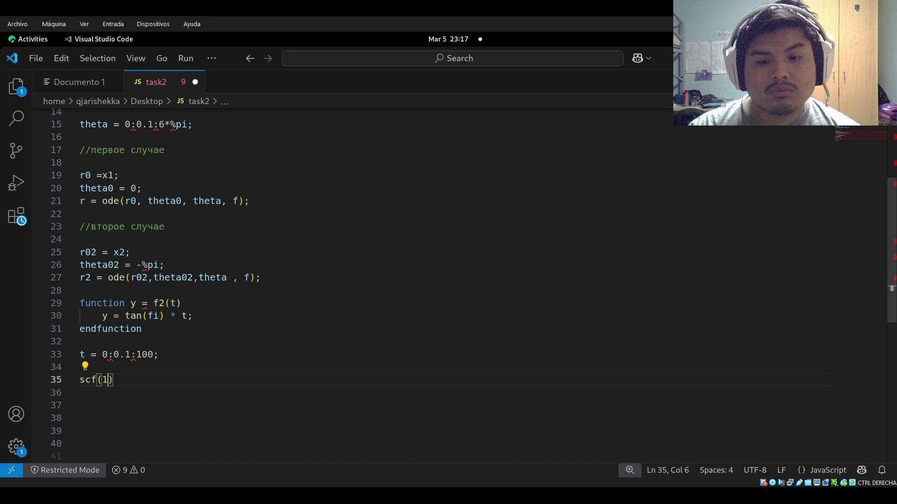
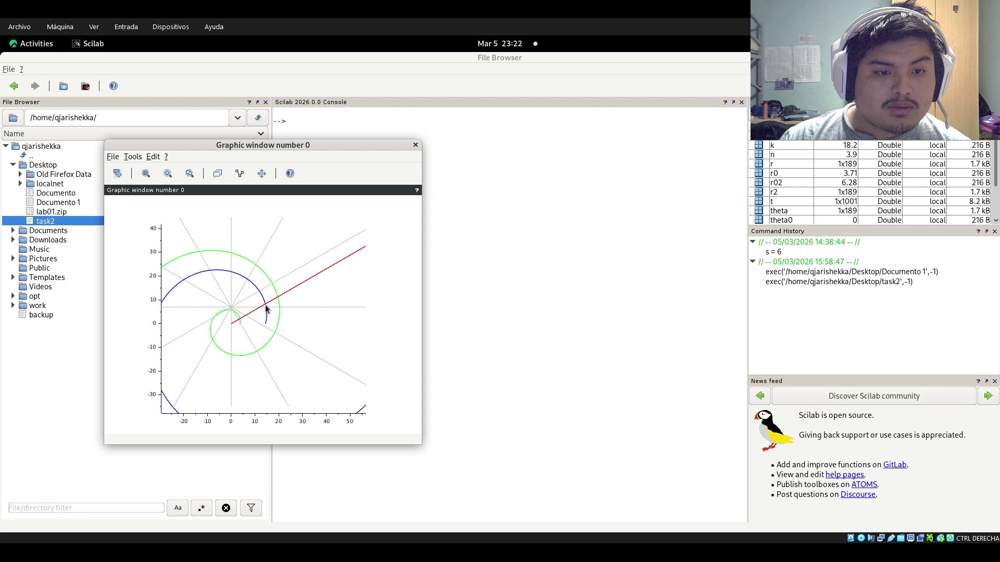

---
## Author
author:
  name: Кхари Жекка Кализая Арсе
  email: 1032234412@rudn.ru
  affiliation:
    - name: Российский университет дружбы народов
      country: Российская Федерация
      postal-code: 117198
      city: Москва
      address: ул. Миклухо-Маклая, д. 6

## Title
title: "отчёт по лабораторной работе №2"
subtitle: "Задача о погоне"
license: "CC BY"
---

# Цель работы

Создать уравнение описывающее движение катера в задаче о погоне и настроить графику

# Задание

1. Провести аналогичные рассуждения и вывод дифференциальных уравнений, если скорость катера больше скорости лодки в n раз (значение n задайтесамостоятельно)
2. Построить траекторию движения катера и лодки для двух случаев. (Задайте самостоятельно начальные значения) Определить по графику точку пересечения катера и лодки.

# Выполнение лабораторной работы

сначала очистил уравнение для общего случая n для двух случаев

{#fig-001 width=70%}

Потом я очистил уравнение, которое описывает траекторию движения катера

{#fig-002 width=70%}

Потом создал файл с примерным кодом

{#fig-005 width=70%}

и потом я выполнил его, я там смог смотреть графику, в которой есть спираль и линия. они пересикаются в точке 622,-622, это значить что катер может поймать лодку в такой точке.

{#fig-003 width=70%}

{#fig-004 width=70%}

Потом я написал другой код, который нарисует другую графику решающую задание 63

{#fig-006 width=70%}

{#fig-007 width=70%}

{#fig-008 width=70%}

и потом я запустил его и смотрел такую графику, и там видно что они пересикаются в точке 15,9 

{#fig-009 width=70%}

{#fig-010 width=70%}

# Выводы

в этой лабораторной работе я смог смотреть, как использовать scilab и как решать задаче о погоне.

# Список литературы{.unnumbered}

::: {#refs}
:::
