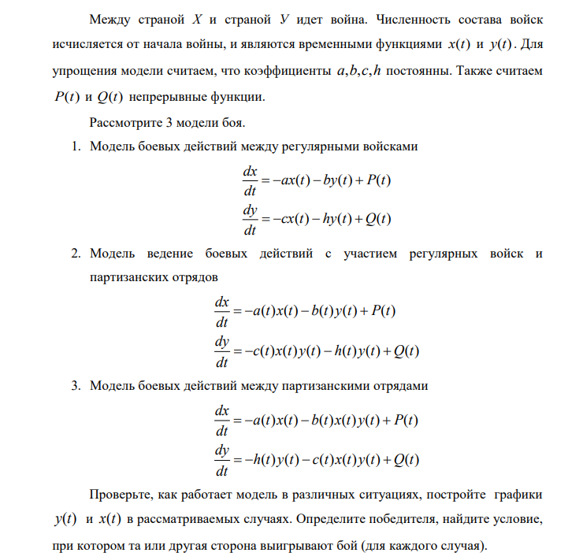
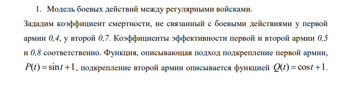
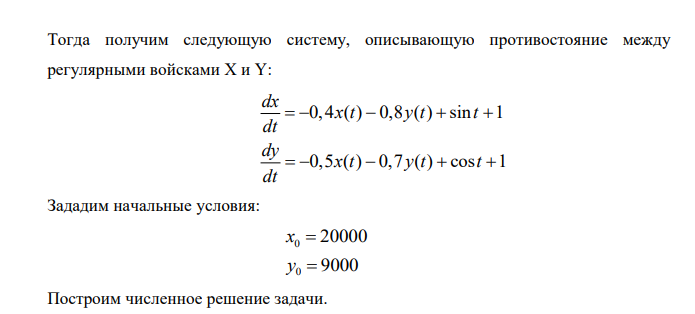
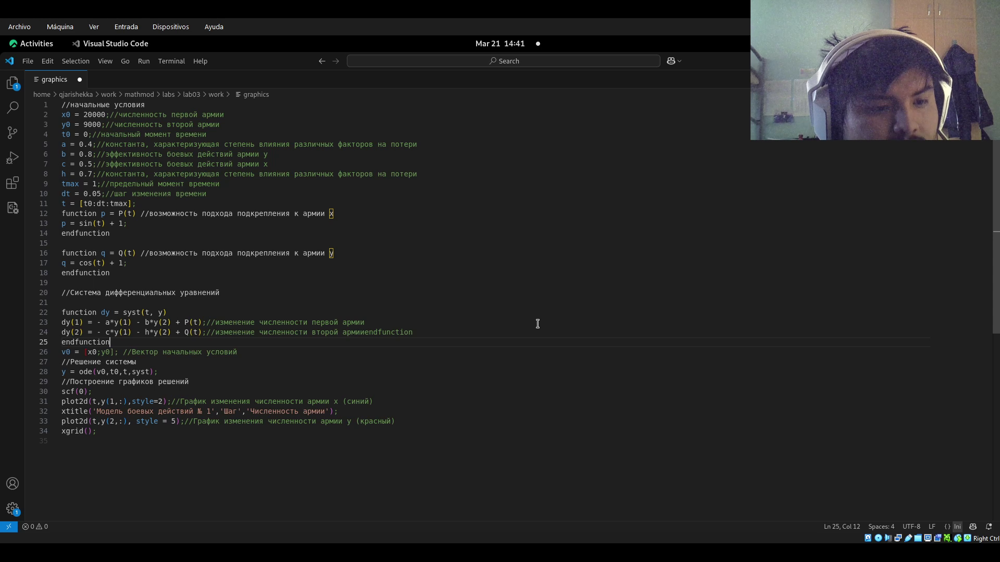
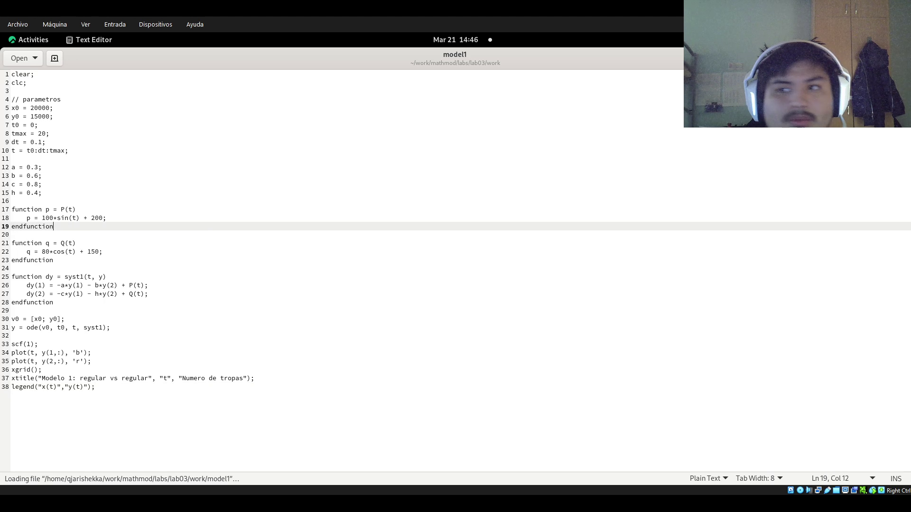
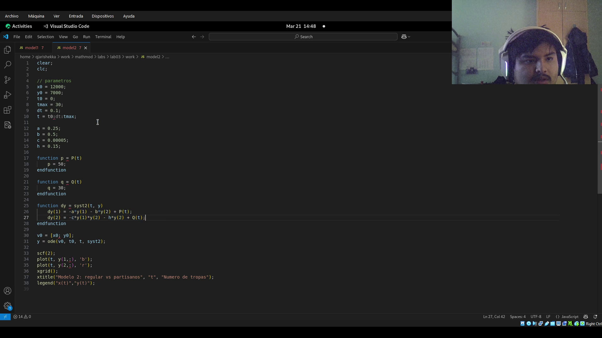
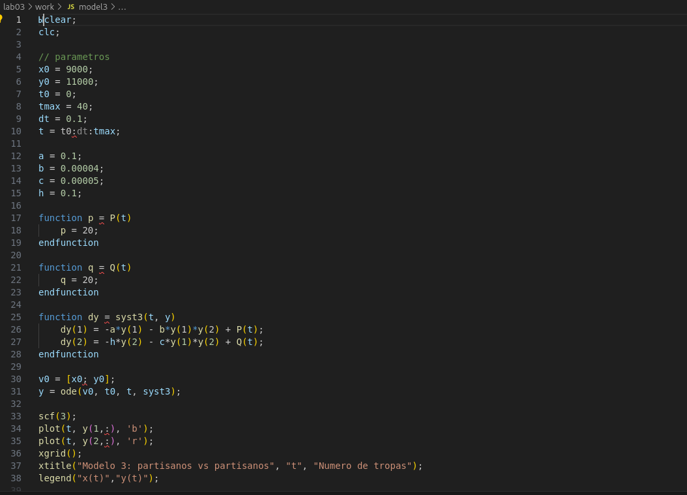

---
## Author
author:
  name: Кхари Жекка Кализая Арсе
  email: 1032234412@pfur.ru
  affiliation:
    - name: Российский университет дружбы народов
      country: Российская Федерация
      postal-code: 117198
      city: Москва
      address: ул. Миклухо-Маклая, д. 6

## Title
title: "Лабораторная работа № 2"
subtitle: "Модель боевых действий "
license: "CC BY"
---

# Цель работы

построить график дифференциальных функций, представляющих дуэль с условиями победы и поражения

# Задание

# Выполнение лабораторной работы

Сначала я создал файл, в котором я сохранил примерный код чтобы смотреть как работает и построить графику 

{#fig-001 width=70%}

Дальше я написал код чтобы настроить графики моедлей 1 2 и 3

{#fig-002 width=70%}

{#fig-003 width=70%}

{#fig-004 width=70%}

# Выводы

В этой лаборатоной работе я мог видеть на графике дифференциальных уравнений решение задач о боевых действиях

# Список литературы{.unnumbered}

::: {#refs}
:::
