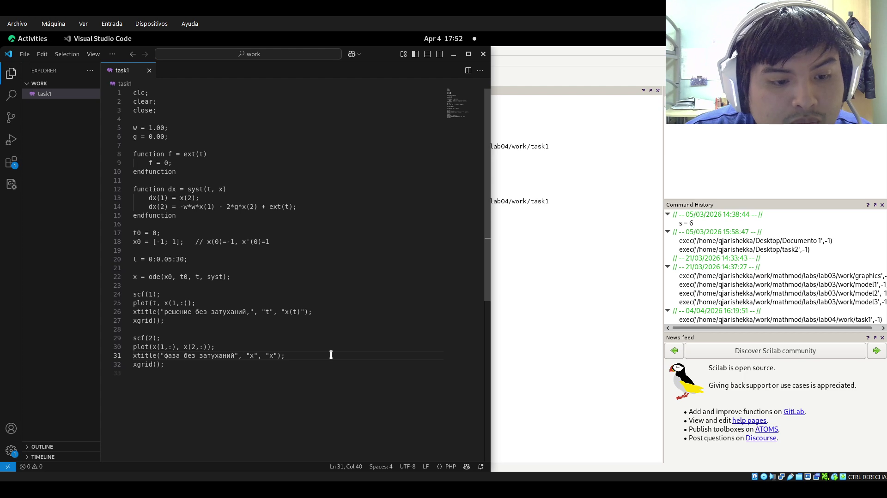
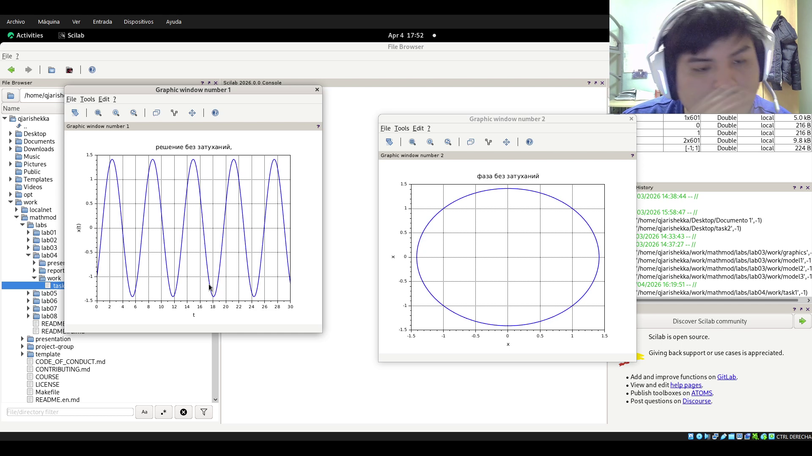
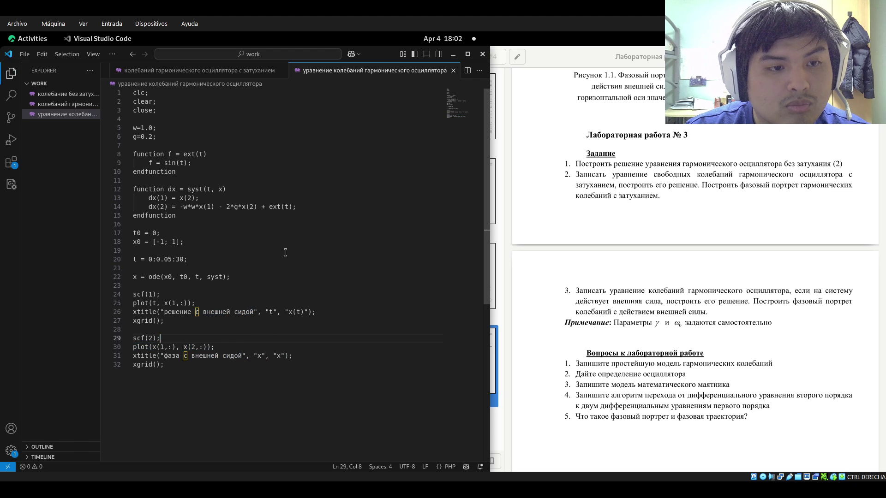
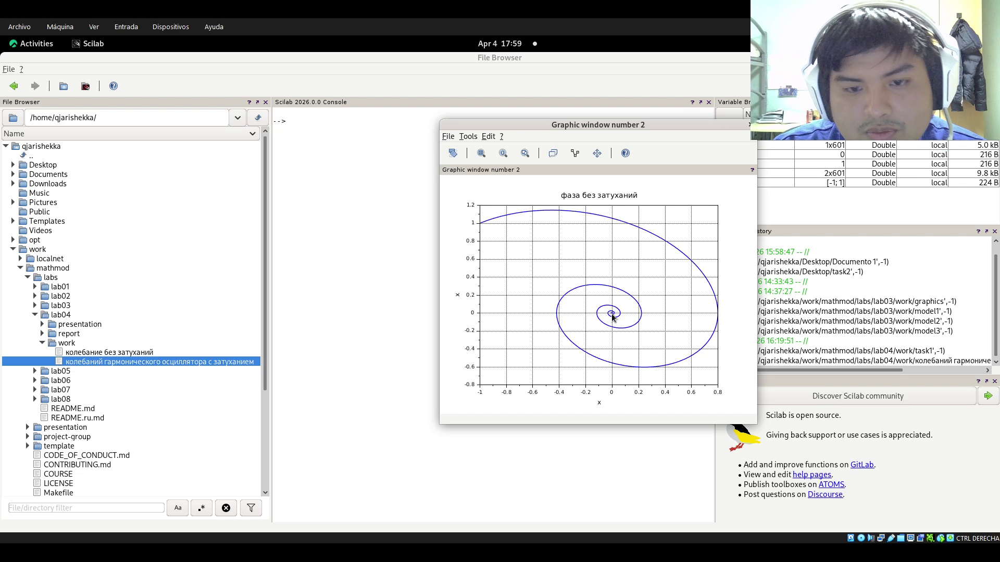
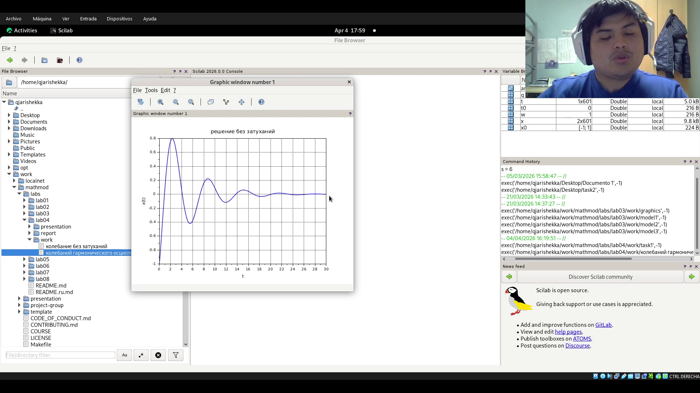
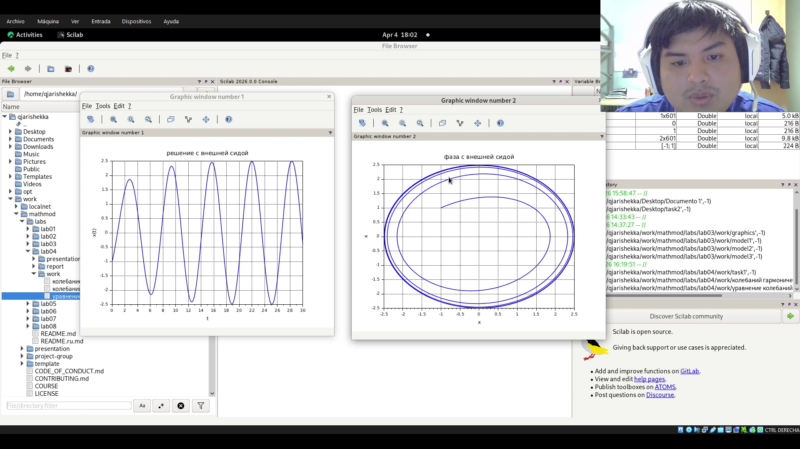

---
## Author
author:
  name: Кхари Жекка Кализая Арсе
  email: 1032234412@rudn.ru
  affiliation:
    - name: Российский университет дружбы народов
      country: Российская Федерация
      postal-code: 117198
      city: Москва
      address: ул. Миклухо-Маклая, д. 6

## Title
title: "отчёт по лабораторной работе №4"
subtitle: "Модель гармонических колебаний"
license: "CC BY"
---

# Цель работы

создать графику и найти решения диференциальных уравнений для задач колебаний

# Задание

1. Построить решение уравнения гармонического осциллятора без затухания (2)
2. Записать уравнение свободных колебаний гармонического осциллятора с
затуханием, построить его решение. Построить фазовый портрет гармонических
колебаний с затуханием.
3. Записать уравнение колебаний гармонического осциллятора, если на систему
действует внешняя сила, построить его решение. Построить фазовый портрет
колебаний с действием внешней силы.

# Выполнение лабораторной работы

сначала я решил первый задание. для того я написал следующий код

{#fig-001 width=70%}

дальше я запустил его и смотрел графики  ([рис. @fig-002]).

 {#fig-002 width=70%}

 там видно что система стабилно.

 Потом я написал код для колебания с затухнением ([рис. @fig-003]) я только изменил параметр g который значит затухнение.

{#fig-003 width=70%}

потом я запустил его и смотрел две графики. фаза и колебание. там видно что в течение времени она изменяется ([рис. @fig-004]) и ([рис. @fig-005]).

{#fig-004 width=70%}

{#fig-005 width=70%}

потом я написал код для колебания с затуханием и с внешней силой ([рис. @fig-006]).

{#fig-006 width=70%}

и еще раз я запустил его и смотрел оба графики

{#fig-007 width=70%}

# Выводы

в этой лабораторной работе я смог смотреть как настроить графики и упрашать диференциальные уравнения чтобы решать его в Scilabs

# Список литературы{.unnumbered}

::: {#refs}
:::
