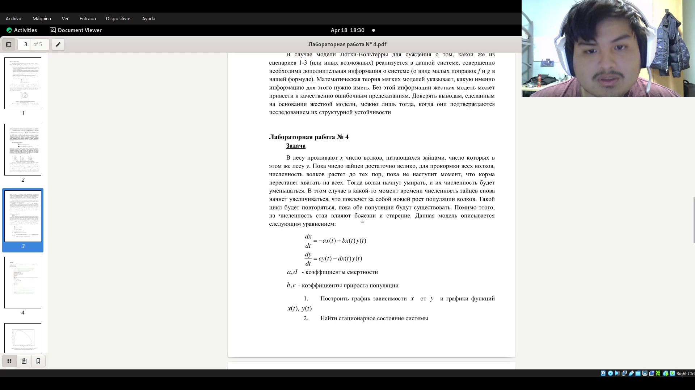
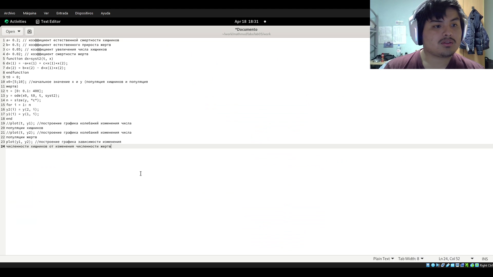
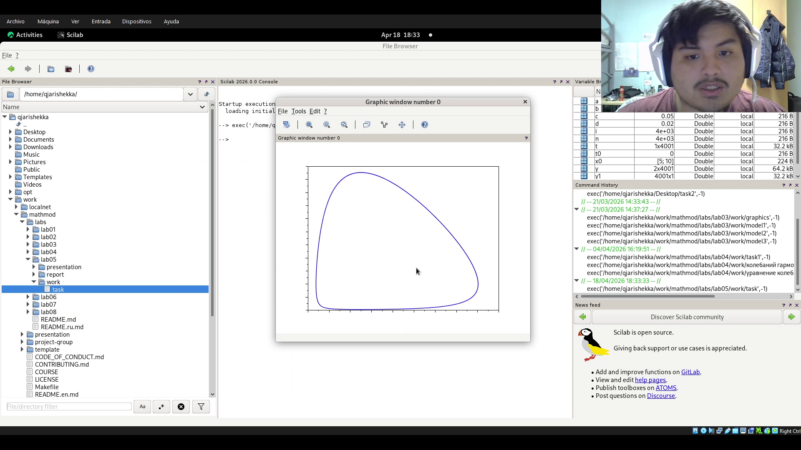
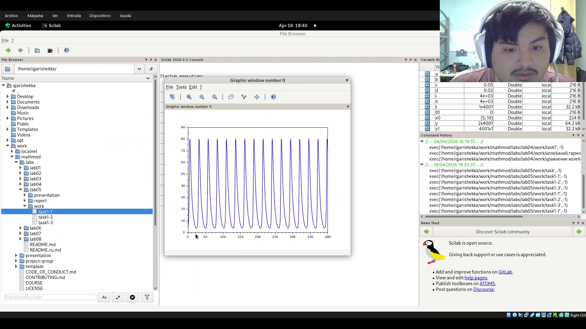

---
## Author
author:
  name: Кхари Жекка Кализая Арсе
  email: 1032234412@rudn.ru
  affiliation:
    - name: Российский университет дружбы народов
      country: Российская Федерация
      postal-code: 117198
      city: Москва
      address: ул. Миклухо-Маклая, д. 6

## Title
title: "отчёт по лабораторной работе №5"
subtitle: "Модель хищник-жертва"
license: "CC BY"
---

# Цель работы

моделировать модель хищник-жертва

# Задание

Задача
В лесу проживают х число волков, питающихся зайцами, число которых в
этом же лесу у. Пока число зайцев достаточно велико, для прокормки всех волков,
численность волков растет до тех пор, пока не наступит момент, что корма
перестанет хватать на всех. Тогда волки начнут умирать, и их численность будет
уменьшаться. В этом случае в какой-то момент времени численность зайцев снова
начнет увеличиваться, что повлечет за собой новый рост популяции волков. Такой
цикл будет повторяться, пока обе популяции будут существовать. Помимо этого,
на численность стаи влияют болезни и старение. Данная модель описывается
следующим уравнением:

# Выполнение лабораторной работы

Сначала я читал задачу  ([рис. @fig-00]).

{#fig-00 width=70%}

Дальше я создал новый файл и там я вставил данный код ([рис. @fig-002]).

{#fig-002 width=70%}

Дальше чтобы смотреть остальные графики я раскомментировал остальные графики, для каждого я создал один файл 

{#fig-003 width=70%}

{#fig-004 width=70%}

в этих графики мы можем смотреть как измениет отношение хищников и волков. в второй и третьей графике можно смотреть как измениет количество хищников и жертов в течении времени

# Выводы

в этой лаборатории я смог увидеть, как смоделировать идеальный случай кишников и желтов

# Список литературы{.unnumbered}

::: {#refs}
:::
