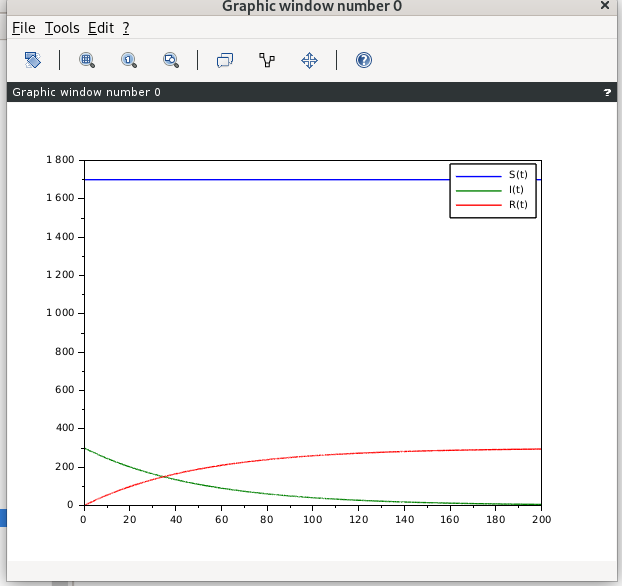
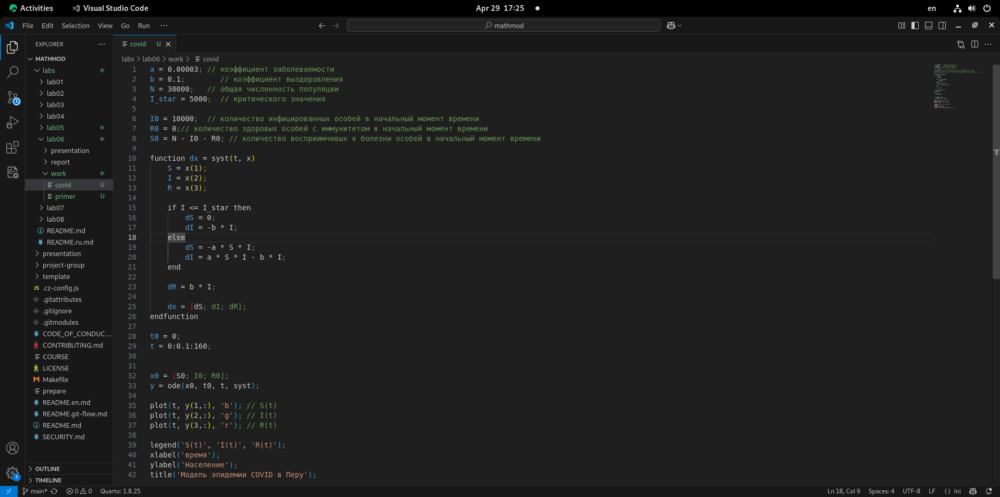
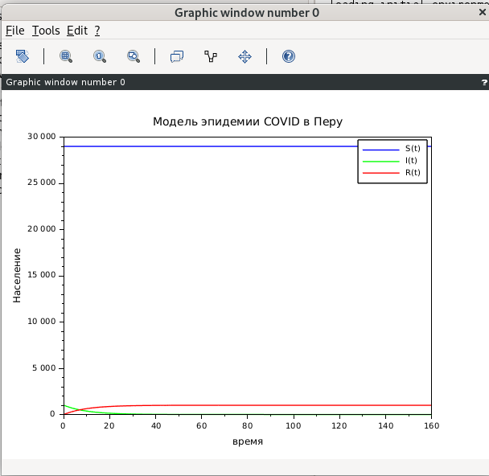
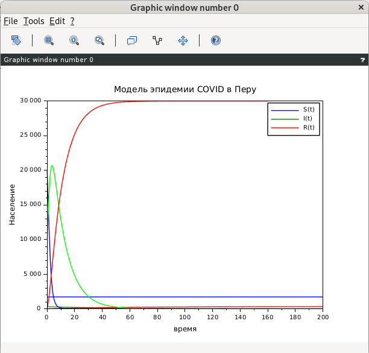

---
## Author
author:
  name: Дмитрий Сергеевич Кулябов
  degrees: DSc
  orcid: 0000-0002-0877-7063
  email: kulyabov-ds@rudn.ru
  affiliation:
    - name: Российский университет дружбы народов
      country: Российская Федерация
      postal-code: 117198
      city: Москва
      address: ул. Миклухо-Маклая, д. 6

## Title
title: "отчёт по лабораторной работе №6"
subtitle: "Задача об эпидемии"
license: "CC BY"
---

# Цель работы

Создать математический модель который описывает распространение эпидемии 

# Задание

Задание
Придумайте свой пример задачи об эпидемии, задайте начальные условия и
коэффициенты пропорциональности. Постройте графики изменения числа особей в
каждой из трех групп. Рассмотрите, как будет протекать эпидемия в случае:

a) if I(0) <= I*
b) if I(0)  > I*

# Выполнение лабораторной работы

Сначала я скопировал данный пример ([рис. @fig-001]).

{#fig-001 width=70%}

Дальше я запустил его в scilab и смотрел графику ([рис. @fig-007]).

{#fig-007 width=70%}

Потом я создал мое пример, в моем случае я создал модель covid 19 в перу, для таго я изменил началные значения как видно в рисунке ([рис. @fig-003]).

{#fig-003 width=70%}

Потом я запустил его, сначала для I = 1000 ([рис. @fig-009]).

{#fig-009 width=70%}

дальше я изменил ту же переменную на 10000 и запустил его([рис. @fig-008]).

{#fig-008 width=70%}

# Выводы

В этой лабораторной работе я смог смотреть как моделировать эпимеию используя критическое значение.

# Список литературы{.unnumbered}

::: {#refs}
:::
