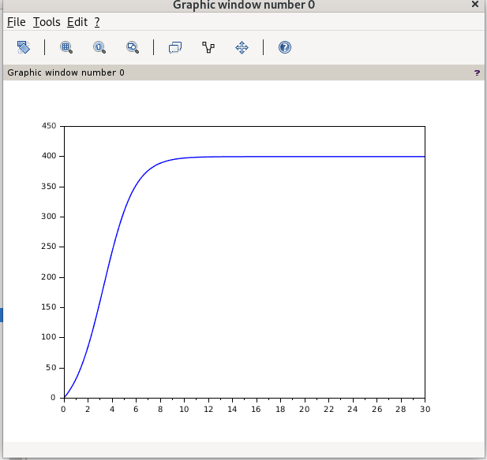
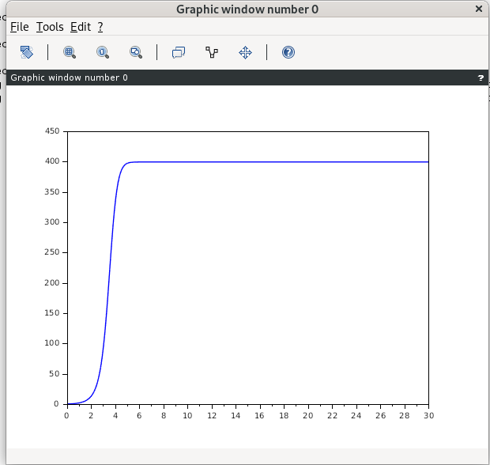
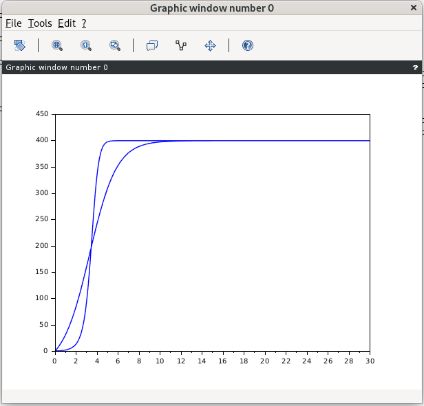
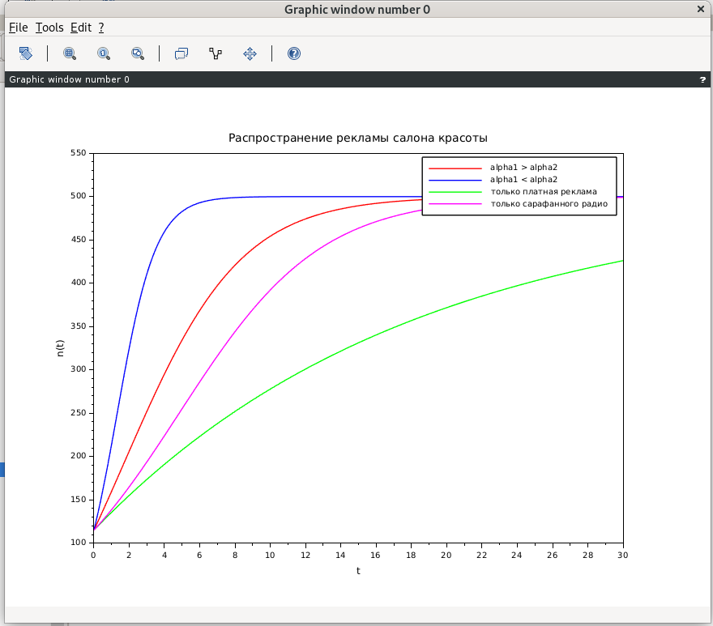

---
## Author
author:
  name: Кхари Жекка Кализая Арсе
  email: 1032234412
  affiliation:
    - name: Российский университет дружбы народов
      country: Российская Федерация
      postal-code: 117198
      city: Москва
      address: ул. Миклухо-Маклая, д. 6

## Title
title: "отчёт по лабораторной работе №7"
subtitle: "Эффективность рекламы"
license: "CC BY"
---

# Цель работы

решать задачи эффективности рекламы

# Задание

## Задача

29 января в городе открылся новый салон красоты. Полагаем, что на момент
открытия о салоне знали N 0
потенциальных клиентов. По маркетинговым
исследованиям известно, что в районе проживают N потенциальных клиентов
салона. Поэтому после открытия салона руководитель запускает активную
рекламную компанию. После этого скорость изменения числа знающих о салоне
пропорциональна как числу знающих о нем, так и числу не знаю о нем.

1. Построить график распространения рекламы о салоне красоты ( N0 и N - задайте самостоятельно).
2. Сравнить эффективность рекламной кампании при $\alpha_1$(t) < $\alpha_1$(t) и $\alpha_1$(t) > $\alpha_1$(t) 
3. Определить в какой момент времени эффективность рекламы будет иметь максимально быстрый рост (на вашем примере).
4. Построить решение, если учитывать вклад только платной рекламы
5. Построить решение, если предположить, что информация о товаре распространятся только путем «сарафанного радио», сравнить оба решения

### Вопросы к лабораторной работе
1. Записать модель Мальтуса (дать пояснение, где используется данная модель)
2. Записать уравнение логистической кривой (дать пояснение, что описывает данное уравнение)
3. На что влияет коэффициент $\alpha_1$(t) и $\alpha_2$(t) в модели распространения рекламы
4. Как ведет себя рассматриваемая модель при $\alpha_1$(t) >> $\alpha_1$(t)
5. Как ведет себя рассматриваемая модель при $\alpha_1$(t) << $\alpha_1$(t)


# Выполнение лабораторной работы

Сначала я выполнил следующие коды в Sci lab чтобы смотреть их

## пример 1:

```
t0 = 0; //начальный момент времени
x0 = 1; // количество людей, знающих о товаре в начальный момент времени
N = 400; // максимальное количество людей, которых может заинтересовать товар
t = 0: 0.1: 30; // временной промежуток (длительность рекламной компании)
//функция, отвечающая за платную рекламу
function g=k(t);
g = 0.055;
endfunction
//функция, описывающая сарафанное радио
function v=p(t);
v = 0.0018;
endfunction
//уравнение, описывающее распространение рекламы
function xd=f(t, x);
xd = ( k(t) + p(t)*x )*( N - x );
endfunction
x = ode(x0, t0, t, f); //решение ОДУ
plot(t, x); //построение графика решения
```

## пример 2:

```
t0 = 0; //начальный момент времени
x0 = 1; // количество людей, знающих о товаре в начальный момент времени
N = 400; // максимальное количество людей, которых можетзаинтересовать товар
t = 0: 0.1: 30; // временной промежуток (длительность рекламной компании)
//функция, отвечающая за платную рекламу
function g = k(t);
g = 0.005*t;
endfunction
//функция, описывающая сарафанное радио
function v = p(t);
v = 0.002*t;
endfunction
//уравнение, описывающее распространение рекламы
function xd = f(t, x);
xd = ( k(t) + p(t)*x )*( N - x );
endfunction
x = ode(x0, t0, t, f); //решение ОДУ
plot(t, x); //построение графика решения
```


{#fig-001 width=70%}

{#fig-002 width=70%}


Потом я сравнил их и заметил что и как и ожидалось, второй график растёт быстрее, потому что его константы g и v изменяются в течении времени


{#fig-003 width=70%}

Дальше я создал новый код чтобы решать вопросы задачи

## код дла задачи:

```
t0 = 0; //начальный момент времени
N0 = 115; // количество людей, знающих о товаре в начальный момент времени
N = 500;  // максимальное количество людей, которых может заинтересовать товар
t = 0:0.1:30; // временной промежуток (длительность рекламной компании)

//alpha1 > alpha2
function g = k1(t)
    g = 0.055; // платная реклама
endfunction

function v = p1(t)
    v = 0.0005; // сарафанного радио
endfunction

function xd = f1(t, x)
    xd = (k1(t) + p1(t)*x) * (N - x);
endfunction

x1 = ode(N0, t0, t, f1);


//alpha1 < alpha2
function g = k2(t)
    g = 0.005; //платная реклама
endfunction

function v = p2(t)
    v = 0.0018; //сарафанного радио
endfunction

function xd = f2(t, x)
    xd = (k2(t) + p2(t)*x) * (N - x);
endfunction

x2 = ode(N0, t0, t, f2);


// только платная реклама
function xd = f_paid(t, x)
    xd = k1(t) * (N - x);
endfunction

x_paid = ode(N0, t0, t, f_paid);


// только сарафанного радио
function xd = f_word(t, x)
    xd = p1(t) * x * (N - x);
endfunction

x_word = ode(N0, t0, t, f_word);


// графики
plot(t, x1, "r");
plot(t, x2, "b");
plot(t, x_paid, "g");
plot(t, x_word, "m");

legend("alpha1 > alpha2", "alpha1 < alpha2", "только платная реклама", "только сарафанного радио");
xlabel("t");
ylabel("n(t)");
title("Распространение рекламы салона красоты");
```

{#fig-004 width=70%}

такая графика решает все вопросы. можно смотреть что синяя линия $\alpha_1$ < $\alpha_2$  растёт быстрее и в интервале 2–4 график растёт наиболее быстро. также распространение графика платной ракламы растёт медленее чем графика сарафанного радио 


# Выводы


в этой лаборатории мы смогли смоделировать взаимодействие, распространение и эффективность пропаганды, и можно было доказать, что она эффективна только в том случае, если из уст в уста передается информация в пользу кампании, поскольку на нее легко приходится 70% эффективности кампании


# Список литературы{.unnumbered}

::: {#refs}
:::
