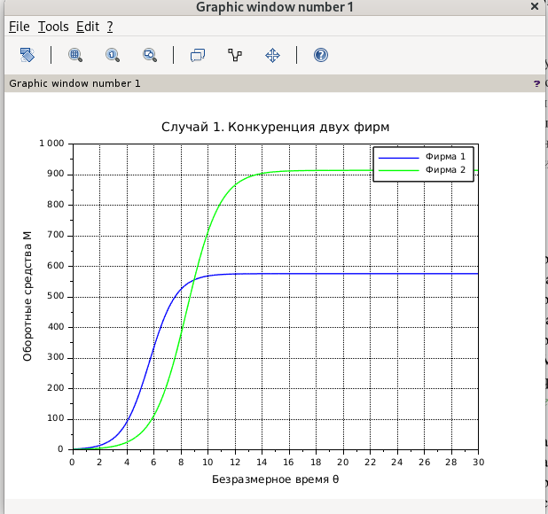
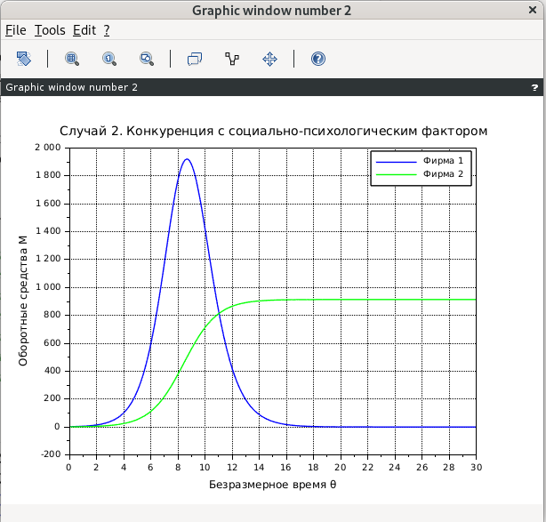

---
## Author
author:
  name: Кхари Жекка Кализая Арсе
  email: 1032234412@pfur.ru
  affiliation:
    - name: Российский университет дружбы народов
      country: Российская Федерация
      postal-code: 117198
      city: Москва
      address: ул. Миклухо-Маклая, д. 6

## Title
title: "отчёт по лабораторной работе №8"
subtitle: "Модель конкуренции двух фирм."
license: "CC BY"
---

# Цель работы

моделировать конкуренцию двух фирм

# Задание

1. Придумайте свой пример двух конкурирующих фирм с идентичным
товаром. Задайте начальные значения и известные составляющие. Постройте
графики изменения объемов оборотных средств каждой фирмы. Рассмотрите
два случая.
2. Проанализируйте полученные результаты.
3. Найдите стационарное состояние системы для первого случая.


# Выполнение лабораторной работы


Сначала я создал файл в котором я написал код


файл task

```

p_cr =  25; //критическая стоимость продукта
tau1 =  8; //длительность производственного цикла фирмы 1
p1 =    10; //себестоимость продукта у фирмы 1
tau2 =  14; //длительность производственного цикла фирмы 2
p2 =    8; //себестоимость продукта у фирмы 2
N =     12; //число потребителей производимого продукта
q =     1; //максимальная потребность одного человека в продукте в единицу времени
M10=    3;
M20 =   2;

a1 = p_cr / (tau1*tau1 *p1 *p1 * N * q);
a2 = p_cr / (tau2*tau2 *p2 *p2 * N * q);

b = p_cr / (tau1 * tau1 * tau2 * tau2 * p1 * p1 *p2 * p2 * N *q);

c1 = (p_cr-p1)/(tau1*p1);
c2 = (p_cr-p2)/(tau2*p2);

disp("коеффиценты модели");
disp("a1 = " + string(a1));
disp("a2 = " + string(a2));
disp("b = " + string(b));
disp("c1 = " + string(c1));
disp("c2 = " + string(c2));


;//case 1

function dx = syst_case1(t,x)
    dx(1) = (c1/c1)*x(1) - (a1/c1)*x(1)*x(1) - (b/c1)*x(1)*x(2);
    dx(2) = (c2/c1)*x(2) - (a2/c1)*x(2)*x(2) - (b/c1)*x(1)*x(2);
endfunction

t0 = 0;
x0=[2;1] ; //начальное значение объема оборотных средств x1 и х2
t = [0: 0.01: 30];
y1 = ode(x0, t0, t, syst_case1);


scf(1);
plot(t, y1(1, :), "b");
plot(t, y1(2, :), "g");

xtitle("Случай 1. Конкуренция двух фирм", ...
       "Безразмерное время θ", ...
       "Оборотные средства M");

legend("Фирма 1", "Фирма 2");

xgrid();


;//case 2;

function dx = syst_case2(t,x)

    dx(1) = x(1) - ((b/c1) + 0.002) * x(1) * x(2) - (a1 / c1)
    dx(2) = (c2 / c1) * x(2) - (b / c1) * x(1) * x(2) - (a2/c1 ) * x(2) ^ 2;
endfunction


y2 = ode(x0, t0, t, syst_case2);

scf(2);
plot(t, y2(1, :), "b");
plot(t, y2(2, :), "g");

xtitle("Случай 2. Конкуренция с социально-психологическим фактором", ...
       "Безразмерное время θ", ...
       "Оборотные средства M");

legend("Фирма 1", "Фирма 2");

xgrid();


A = [a1, b;
     b,  a2];
Ы
B = [c1;
     c2];

M_stat = A \ B;

disp(" ");
disp("Стационарное состояние для случая 1:");
disp("M1* = " + string(M_stat(1)));
disp("M2* = " + string(M_stat(2)));

```

дальше я его запустил и получил следующие графики, которые показыватю моделирование первого случая и второго соответственно

{#fig-001 width=70%}


{#fig-002 width=70%}

в моем случае я использовал следующие значения:

$p_{cr}$ =  25; //критическая стоимость продукта
$\tau_1$ =  8; //длительность производственного цикла фирмы 1
$p_1$ =    10; //себестоимость продукта у фирмы 1
$\tau_2$ =  14; //длительность производственного цикла фирмы 2
$p_2$ =    8; //себестоимость продукта у фирмы 2
$N$ =     12; //число потребителей производимого продукта
$q$ =     1; //максимальная потребность одного человека в продукте в единицу времени
$M_{1}$=    3;
$M_{2}$ =   2;

также из графики можно сделать вывод, что в первом случае фирма 1 не получила большинства голосов по сравнению с фирмой 2, что можно интерпретировать как проигрыш ([рис. @fig-001]), даже в случае 2 можно увидеть, как фирма 1 обанкротилась, что дает явный победитель в этом моделировании ко второй фирме ([рис. @fig-002]), у которой себестоимость и Продолжительность производственного цикла были ниже, чем у первой фирмы.


# Выводы

в этой лаборатории мы смогли смоделировать конкуренцию между 2 компаниями в идеальном сценарии, имея в виду 2 случая, 1 без влияния общества и предпочтений, а другой, включающий их

# Список литературы{.unnumbered}

::: {#refs}
:::
